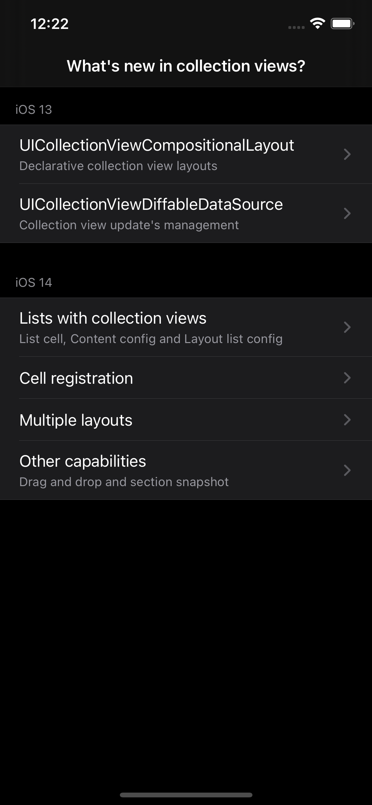
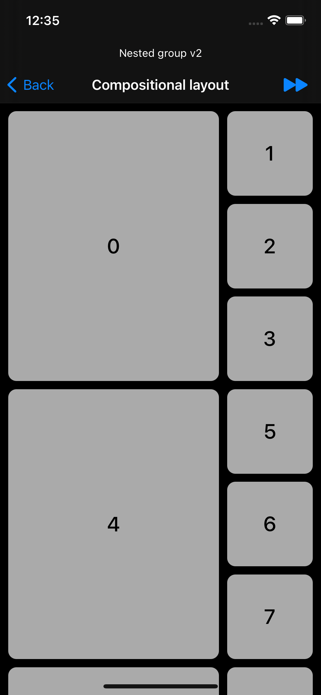
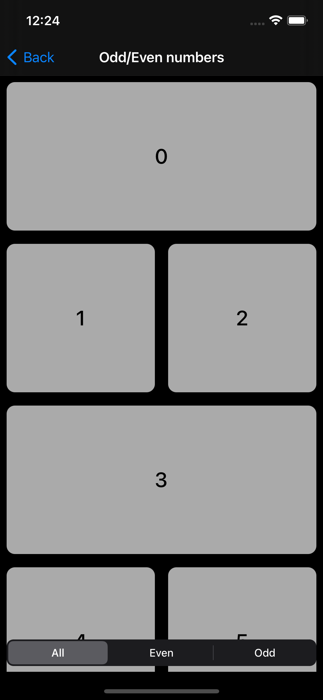
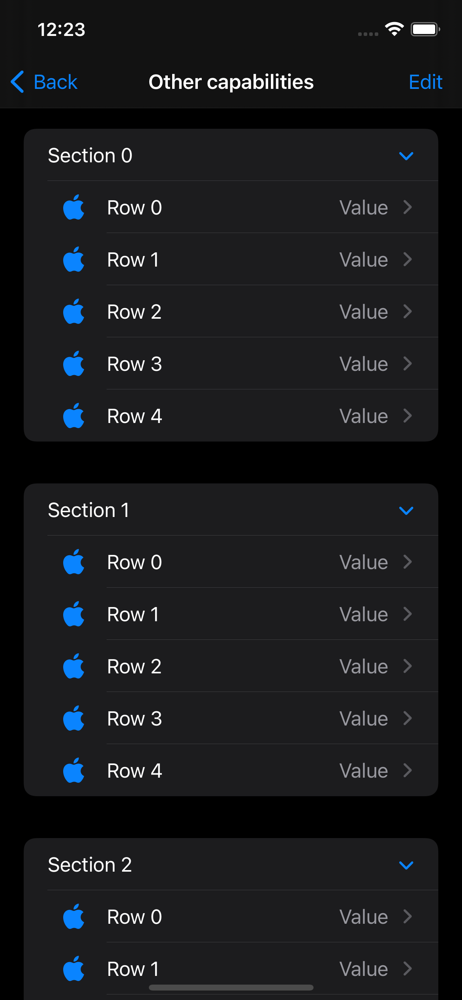

# ModernCollectionViews

Sample project that demonstrates what's new in collection views for iOS 13/14.

## Requirements

- iOS 14.0+
- Xcode 12+

## Screenshots

 
 

 
 Author - Ashish Augustine 
